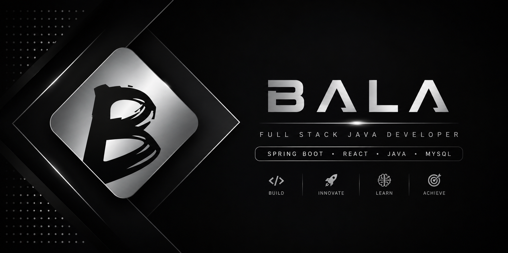

  

<h1 align="center">Hi 👋, I'm Balaji</h1>

<h3 align="center">
Full Stack Java Developer • AI & ML Student • India 🇮🇳
</h3>

---

# 👨‍💻 About Me

- 🎓 Final Year B.Tech CSE (AI & ML)
- 💻 Full Stack Java Developer
- 🌱 Learning Spring Boot, React & AI
- 🚀 Interested in scalable web applications
- 📚 Solving DSA every day

---

# 🛠 Tech Stack

### Languages

### Frontend

### Backend

### Database

### Tools

---

# 🚀 Featured Projects

| Project | Description | Tech |
|---------|-------------|------|
| 🚀 FlowDesk | Task Management Portal | React, Node.js, MySQL |
| 💼 Student Job Portal | Placement Portal | Spring Boot, MySQL |
| ☕ Java Placement Programs | Coding & DSA | Java |

---

# 📈 GitHub Activity

> ## 📈 GitHub Activity

📌 I maintain my projects regularly and continuously improve my skills through hands-on development and coding practice.

---

# 🌐 Connect With Me

---

⭐ Thanks for visiting my profile!

